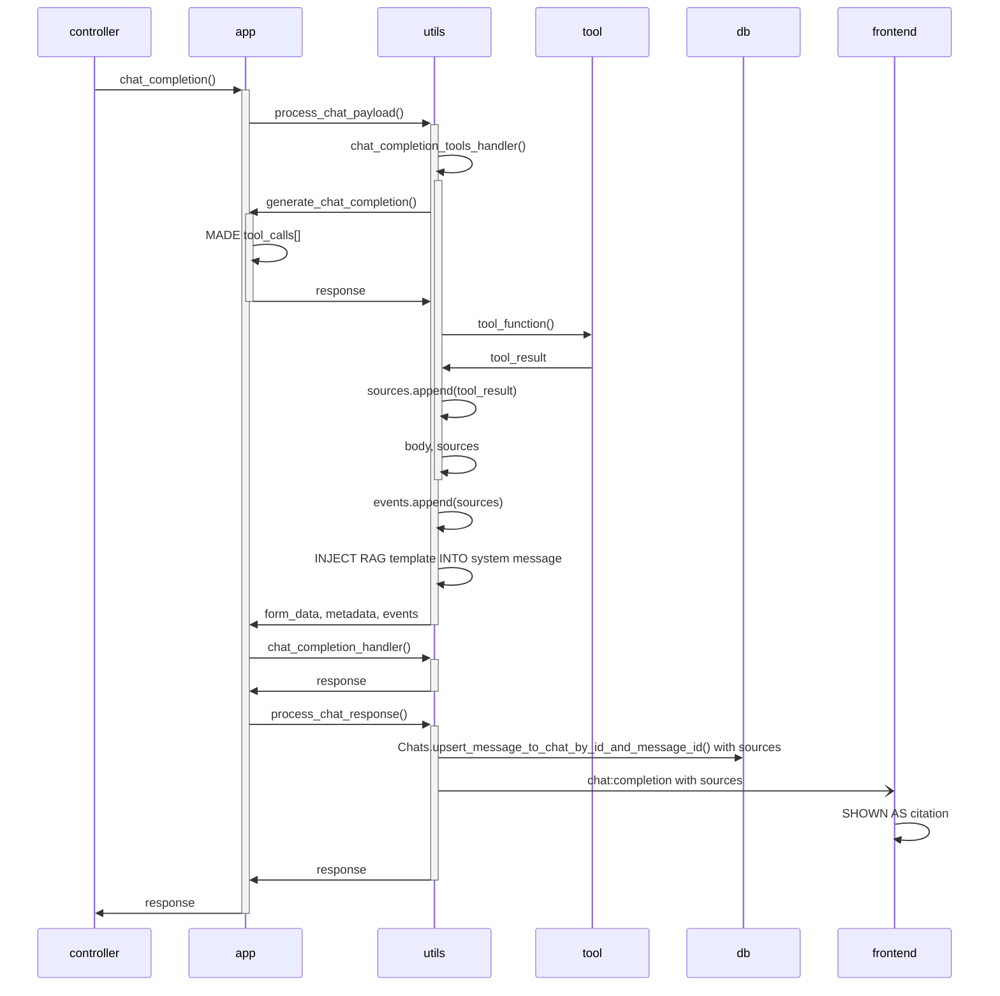
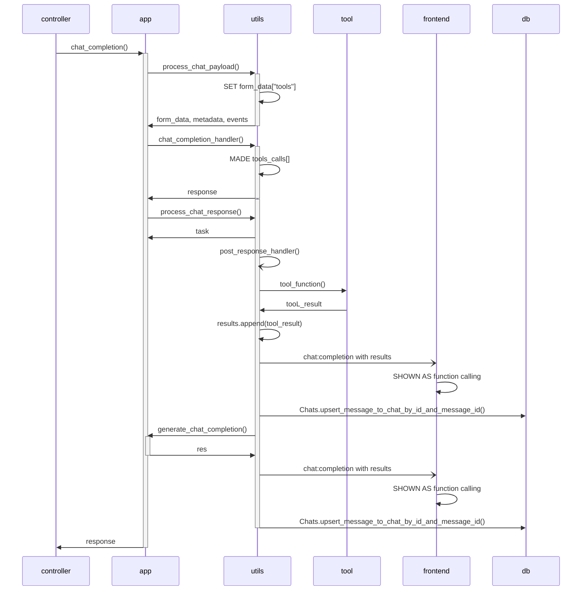
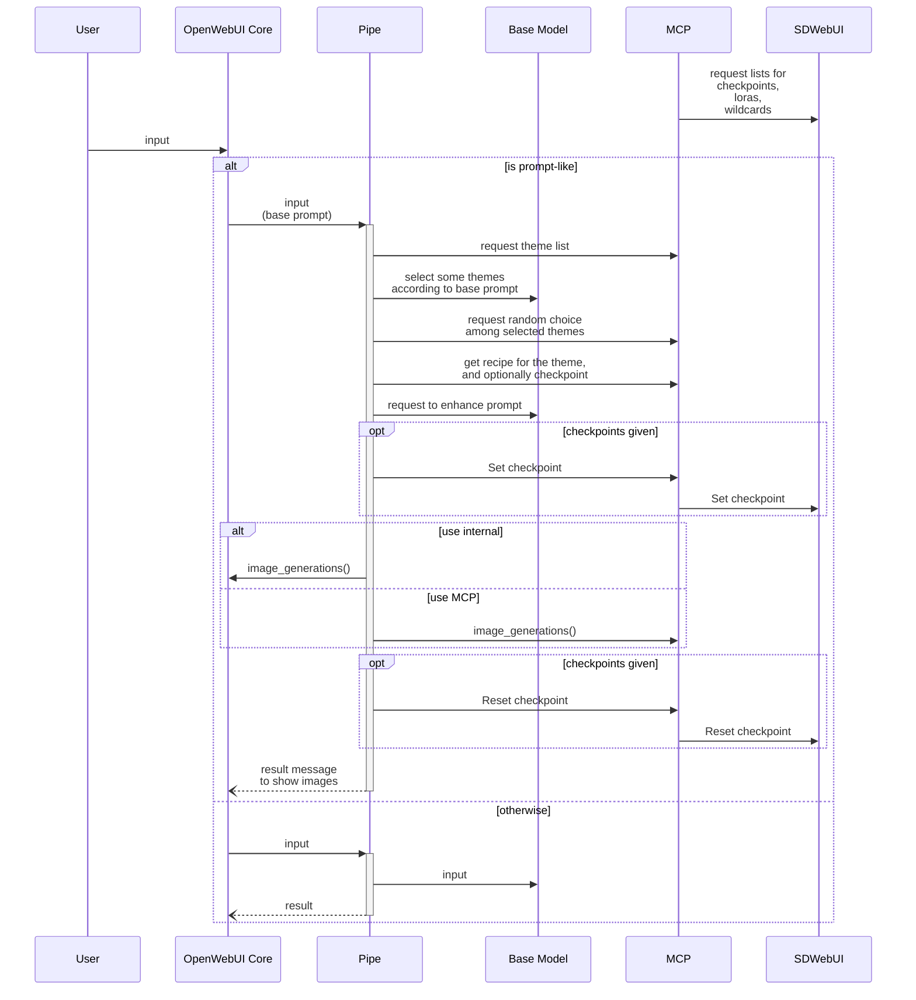

# Open WebUI Plugins

## Plug-Ins

### Image Gen Plus (wip)

This is a modified version for [Image Gen (0.5.3+)](https://openwebui.com/t/justinrahb/image_gen), which appears to be derived from [Image Gen](https://openwebui.com/t/jayhay123/image_gen).

Both of these versions do not have license information. The plugin sources are public, and Open WebUI itself is released under BSD-3-Clause license, so it is assumed that the plugins are also released under a similar license.

### Repeat Input

This action is for repeating the last USER message in the chat. Even though action buttions are shown at the last ASSISTANT message, the last USER message is used for the content. Only 1 action buttion is shown until https://github.com/open-webui/open-webui/discussions/12169 is accepted.
1-Click action button is for repeating the last USER message.
Dialog action button is for modifying the last USER message.

## Development Notes

As of this writing, sufficient documentataion is not provided, therefore we need to investigate Open WebUI sources to develop plugins. Here are some notes I investigated.

### Citation event

* Handled by frontend
  * https://github.com/open-webui/open-webui/blob/b03fc97e287f31ad07bda896143959bc4413f7d2/src/lib/components/chat/Messages/Citations.svelte#L92
  * https://github.com/open-webui/open-webui/blob/b03fc97e287f31ad07bda896143959bc4413f7d2/src/lib/components/chat/Messages/CitationsModal.svelte#L49
* Sumary of child elements of `data`
  * `source.name` is shown in the chat space with a link to show modal dialog.
  * If there are no `document` elements, there is no content in the dialog.
  * `document[]`, `metadata[]` and `distance[]` are corresponding by index. For example, `metadata[0]` describes `document[0]`. On the other hand, `source` is shared by documents.
  * There are `metadata[].page` for Source and `distance[]` for Relevance in Source. Details omitted here.
  * Source
    * If `metadata[].file_id` is present, `/api/v1/files/<file_id>/content` is used for the URL instead of `source.url`.
    * `source.url` should include the string `http`. Without it, `#` is used for a URL.
    * `metadata[].name` (if present) or `source.name` is shown with a link to the URL above.
  * Content
    * If `metadata[].html` is True, `document[]` is embedded in `srcdoc` of `<iframe>`.

### Image generation

* DEFAULT_IMAGE_PROMPT_GENERATION_PROMPT_TEMPLATE
https://github.com/open-webui/open-webui/blob/b03fc97e287f31ad07bda896143959bc4413f7d2/backend/open_webui/config.py#L1200
* Backend API: image_generations()
https://github.com/open-webui/open-webui/blob/b03fc97e287f31ad07bda896143959bc4413f7d2/backend/open_webui/routers/images.py#L468
  * ComfyUI and a1111 can handle a `negative_prompt` parameter.
  * Multiple images can be generated by specifying `n` parameter. This parameter is passed through to image generators.
* Generated images are returned as URL `/api/v1/files/<file_id>/content`.
  * This URL is handled by get_file_content_by_id() https://github.com/open-webui/open-webui/blob/b03fc97e287f31ad07bda896143959bc4413f7d2/backend/open_webui/routers/files.py#L230
    * `Content-Disposition` HTTP header is added except for `text/plain` files, so image file is downloaded if the URL is accessed by a browser.
    * `/api/v1/files/<file_id>/content/html` is used to display images.
    * `/api/v1/files/<file_id>` is a JSON including parameters passed to the image generator.

### Tool

* `DEFAULT_TOOLS_FUNCTION_CALLING_TEMPLATE`
https://github.com/open-webui/open-webui/blob/b03fc97e287f31ad07bda896143959bc4413f7d2/backend/open_webui/config.py#L1344
* Called from `chat_completion_tools_handler()`
https://github.com/open-webui/open-webui/blob/b03fc97e287f31ad07bda896143959bc4413f7d2/backend/open_webui/utils/middleware.py#L102
  * If `str` is returned, `citation` event is emitted as described in https://docs.openwebui.com/features/plugin/tools/#citations
  * `tools` are collected here: `get_tools()` https://github.com/open-webui/open-webui/blob/b03fc97e287f31ad07bda896143959bc4413f7d2/backend/open_webui/utils/tools.py#L38
    * extra parameters are prepared also here: `process_chat_payload()` https://github.com/open-webui/open-webui/blob/b03fc97e287f31ad07bda896143959bc4413f7d2/backend/open_webui/utils/middleware.py#L625

#### Non-native function calls and native function calls

* For native function calls, there are few options to show results to users.
 `event_emitter()` postponed by `create_task()` is one promising way.
* For non-native function calls, it might be better to return just `None` regardless of success or fail. Throwing exception and returning `str`, `dict` and `list` cause injecting RAG system prompt which often produces confusing messages.

| |Non-native function calling|Native function calling|
|-|-|-|
|`event_emitter()` in a `Tool`|Work as expected|Overwritten (in another word, vanished) by proceeding `chat:completion` message by displaying function calling|
|Returned value from `Tool`|Shown as citation and processed by injected RAG system prompt|Shown as text in function calling|
|Exception in a `Tool`|Same as above|Same as above|

#### Brief sequence of non-native function calls (not precisely)



#### Brief sequence of native function calls (not precisely)



### Action

* Action is loaded from module by: get_action_items_from_module() https://github.com/open-webui/open-webui/blob/b03fc97e287f31ad07bda896143959bc4413f7d2/backend/open_webui/utils/models.py#L171
  * Module is loaded by: load_function_module_by_id() https://github.com/open-webui/open-webui/blob/b03fc97e287f31ad07bda896143959bc4413f7d2/backend/open_webui/utils/plugin.py#L118
* Action is handled by: chat_action() https://github.com/open-webui/open-webui/blob/b03fc97e287f31ad07bda896143959bc4413f7d2/backend/open_webui/utils/chat.py#L348
* Action is rendered by: https://github.com/open-webui/open-webui/blob/b03fc97e287f31ad07bda896143959bc4413f7d2/src/lib/components/chat/Messages/ResponseMessage.svelte#L1299
* Action has an optional `actions` attribute similar as `pipes` in pipe functions `actions` but it can not be a callable different from `pipes`.

### Chat

* event_caller() and event_emitter() make `chat_events` on frontend-backend socket.
  * Handled by frontent: https://github.com/open-webui/open-webui/blob/b03fc97e287f31ad07bda896143959bc4413f7d2/src/lib/components/chat/Chat.svelte#L237
    * If input is canceled, false is returned by callback. https://github.com/open-webui/open-webui/blob/b03fc97e287f31ad07bda896143959bc4413f7d2/src/lib/components/chat/Chat.svelte#L1895
* New message ID is created by UUIDv4
* Chat is updated from frontend to backend by: UpdateChatById() https://github.com/open-webui/open-webui/blob/b03fc97e287f31ad07bda896143959bc4413f7d2/src/lib/apis/chats/index.ts#L793
  * Backend: https://github.com/open-webui/open-webui/blob/b03fc97e287f31ad07bda896143959bc4413f7d2/backend/open_webui/routers/chats.py#L360
    * https://github.com/open-webui/open-webui/blob/b03fc97e287f31ad07bda896143959bc4413f7d2/backend/open_webui/models/chats.py#L161
* Helper functions
  * get_last_user_message() https://github.com/open-webui/open-webui/blob/b03fc97e287f31ad07bda896143959bc4413f7d2/backend/open_webui/utils/misc.py#L82
  * add_or_update_user_message() https://github.com/open-webui/open-webui/blob/b03fc97e287f31ad07bda896143959bc4413f7d2/backend/open_webui/utils/misc.py#L152
    * does not trigger chat completion
* Frontend builds parent-children relationships among messages, creates a pair of user and assistant messages when a user input is submitted, and triggers chat completion. So, it seems that it is a way to call `postMessage()` with `input:prompt` and `input:prompt:submit` type, by a chat message with `execute` type for creating a new user message.

### Consideration to use MCP server for image generation by SD WebUI

* Even in prior-to-PoC state

#### Brief sequence



#### Possible design choice

* Where randomness/variation is provided
  * Options
    * explicit choice by a tool in MCP server
      * simple choice
      * dedicated tool
    * Model
    * logic in Pipe
    * wildcards in SDWebUI
  * Rules
    * wildcard should be self-contained
    * Tool should handle simple choice and complex rule 
    * Avoid logic in Pipe
    * Model should handle not-routine decision
* How to construct final prompts
  * Options
    * Embed a text into the specific placeholder in pre-compiled prompt
      * '... {} ...'.format(enhanced_text)
    * Embed some text into the specific placeholders
      * '... {var1} ... {var2} ...'.format(**arguments)
      * Make query for each parameters if necessary
  * Try both
    * Most elements can be shared. What differs is who calls them.
* image_generations()
  * Options
    * Internal
    * On MCP
  * Internal image_generations() only have the following parameters: `model`, `prompt`, `size`, `n` and `negative_prompt`.
    * Additional parameters, especially for extension control such as Regional Prompter, extends possibility of this workflow.
* How to define recipe
  * Options: Mixture of logic and configuration
  * Prefer configuration

#### Typical scenario

* theme-dependent
  * situation
  * composition
  * specific style
* theme-independent
  * artist style
  * mutually exclusive
    * specific character
    * character properties

#### Rough interface

* High-level
  * RequestThemeList
    * Parameter: None
    * Return: list[Theme]
      * Theme
        * name: str
        * description: str
  * RequestWeightedRandomPick
    * Parameter
      * weights: list[float]
    * Return: int
  * RequestRecipe
    * Parameter
      * name: str
    * Return: Recipe
      * template: str
      * instruct: str
      * checkpoint: str
  * RequestRecipeAlt
    * Returns final prompt directly
    * Parameter
      * arguments: dict[str, str]
    * Return: Recipe
      * prompt: str
      * checkpoint: str
  * RequestSetCheckpoint
    * Parameter
      * checkpoint: str
    * Return: bool
* Low-level
  * RequestLoraList
    * Parameter
      * basemodel: str
    * Return: list[Lora]
      * Lora
        * prompt: str
        * description: str
  * RequestWildcardList
    * Parameter: None
    * Return: list[Wildcards]
      * Wildcards
        * prompt: str
        * description: str

#### Invocation

```
uvx mcpo --port 8000 -- uv run --with mcp mcp run ./server.py
```
